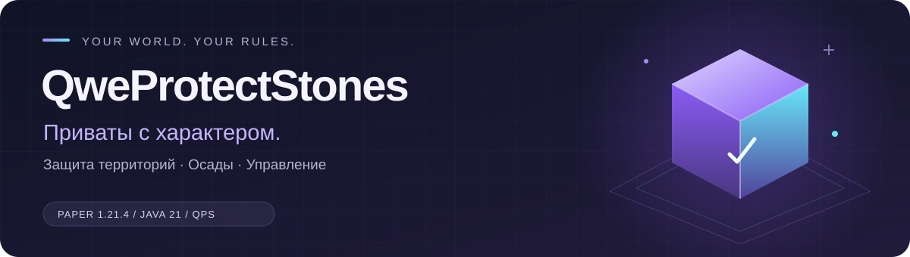

<div align="center">



# 🪨 QweProtectStones

**Ваш мир. Ваши правила. Собственная защита — без обязательных плагинов приватов.**

[](docs/installation.md)
[](docs/installation.md)
[](docs/installation.md#reload-и-folia)
[](https://github.com/qweyns/QweProtectionStones/actions/workflows/build.yml)

**[Начать установку](docs/installation.md) · [Документация](docs/README.md) · [Команды](docs/commands.md) · [API](docs/api.md)**

[Релизы](https://github.com/qweyns/QweProtectionStones/releases) · [Сборки CI](https://github.com/qweyns/QweProtectionStones/actions) · [Сообщить об ошибке](https://github.com/qweyns/QweProtectionStones/issues)

</div>

---

Приваты на блоках-ядрах для **Paper 1.21.4 / Java 21**, с мостом планировщиков для Folia.
Собственная защита территорий: WorldGuard и ProtectionStones не требуются.

Игрок устанавливает ядро, вокруг которого создаётся прямоугольный регион.
Доступ определяется владельцем, участниками, уровнями доверия и флагами.
Прочность ядра, осады и разрушение построек — отдельные настраиваемые правила.

## ✨ Что внутри

| 🛡️ Защита и доступ | ⚔️ Осады и развитие | 🎨 Оформление и управление |
| :--- | :--- | :--- |
| Собственная система регионов | Прочность и ремонт за предметы | Меню, требования и анимация из YAML |
| 5 уровней доверия, 18 флагов | Урон взрывов, cooldown, штраф ремонта | NATIVE-голограммы; DH/FH на Paper |
| Приглашения, баны, авто-вписывание | Продажа и аренда через Vault | Эффекты, частицы, звуки, 4 языка |
| Контроль пограничных взаимодействий | API для отдельных аддонов взрывчатки | Карты, PAPI и внешние уведомления |

**Хранение без лишней магии:** SQLite или MySQL, пакетная запись, журнал действий,
аварийное восстановление, JSON-экспорт, резервные копии и импорт.

> [!TIP]
> **Начните с одного типа ядра.** Размер, прочность, эффекты, голограмма и правила
> доступа настраиваются в `regions.yml`. Остальные типы добавляйте по мере необходимости.

## 🚀 Быстрый старт

1. Поместите собранный JAR в `plugins/` и запустите сервер на Java 21.
2. Настройте `plugins/QweProtectStones/regions.yml`. Ключ типа — **материал блока**, а не произвольное имя:

   ```yaml
   region_types:
     DIAMOND_BLOCK:
       radius: 8
       radius_y: 32
       max_per_player: 3
       start_durability: 1
       max_durability: 1
   ```

   Это фрагмент: прочие параметры наследуются из `default_region` в том же файле.
3. Выполните `/qps reload`. Для нового имени команды, подключения к БД и connect timeout HTTP-клиентов нужен рестарт.
4. `/qps give <игрок> DIAMOND_BLOCK [количество]` выдаёт предмет-ядро; `/ps help` показывает доступные команды.

> [!IMPORTANT]
> **Обновляете действующий сервер?** Сначала сохраните всю папку плагина и БД.
> Пользовательские конфиги не перезаписываются: недостающие общие параметры
> и переводы читаются из JAR, новые примеры переносятся вручную.

## 🧩 Где что настраивается

| Файл | Назначение |
|---|---|
| `config.yml` | БД, команда, язык, доступ, лимиты, тайминги, журналы, обслуживание |
| `protection.yml` | Воронки, поршни, пограничные взаимодействия, закрытые флаги |
| `siege.yml` | Включение осад, урон за взрыв, cooldown, радиус и штраф |
| `effects.yml` | Цели эффектов и параметры отдельного EffectPurchaseManager |
| `visuals.yml` | Частицы, звуки, индикатор урона, карты |
| `features.yml` | Рынок, аренда, backup, home, импорт, уведомления |
| `regions.yml` | Типы, размеры, прочность, флаги, предметы, рецепты, голограммы |
| `menus/*.yml` | Оформление GUI, анимация, цены и действия кнопок |
| `lang/*.yml` | Сообщения: ru_RU, en_US, es_ES, zh_CN |

> [!NOTE]
> **Цены GUI — в `menus/effects.yml`.** Секция `effects.purchase` относится
> к отдельному EffectPurchaseManager и не меняет стоимость кнопок магазина.

Настройки содержат комментарии; диапазоны новых параметров описаны в [конфигурации](docs/configuration.md).
Защитные пределы, форматы хранения и правила транзакций намеренно остаются в коде.

## ⌨️ Команды под рукой

Игровая команда по умолчанию `/ps`, алиасы `/приват`, `/region`, `/land`, `/rg`.
Имя и алиасы настраиваются через `settings.command`.

| Задача | Команды |
| :--- | :--- |
| 🧭 Посмотреть и найти | `info` · `list` · `findspot` · `home` · `glow` |
| 🔑 Настроить доступ | `trust` · `untrust` · `trustall` · `untrustall` · `members` · `flag` |
| 🤝 Пригласить друзей | `invite` · `accept` · `deny` · `autoadd` · `autoremove` · `autolist` |
| 🚫 Ограничить вход | `ban` · `unban` · `banlist` |
| 💎 Развивать приват | `menu` · `upgrade` · `effects` · `name` |
| 🪙 Совершить сделку | `sell` · `buy` · `rent` · `transfer` |
| 🧰 Управлять | `delete` · `log` · `help` |

Административная команда `/qweprotectstones`, алиасы `/qps`, `/qpstones`.
Полный синтаксис и права — [команды](docs/commands.md).
Команд игроков `expand`, `move`, `greeting`, `farewell` в текущем коде нет.

## 🔌 Подключайте только нужное

Внешние плагины защиты не нужны. Эти интеграции расширяют возможности QPS:

| Интеграция | Что добавляет | Условие |
| :--- | :--- | :--- |
| **Vault + экономика** | Продажа, аренда, оплата деньгами | Нужны Vault и экономический провайдер |
| **PlayerPoints** | Оплата очками в GUI | Не заменяет Vault на рынке |
| **FancyHolograms / DecentHolograms** | Альтернативные голограммы | Только Paper; на Folia — NATIVE |
| **PlaceholderAPI** | Плейсхолдеры для чата, таба и скорбордов | Опционально |
| **Dynmap / BlueMap** | Регионы на веб-карте | Опционально |
| **DiscordSRV / вебхуки** | Внешние уведомления | Discord и Telegram настраиваются отдельно |
| **QweTnts и другие аддоны** | Классификация взрывов и API урона | Отдельные плагины, не часть QPS |

Подробнее: [интеграции](docs/integrations.md) · [голограммы](docs/holograms.md) · [контракт взрывов](docs/explosions-api.md).

## 🛠️ Эксплуатация без сюрпризов

> [!WARNING]
> **Folia: NATIVE-голограммы и полный restart для выгрузки.**
> Горячий unload и серверный `/reload` не поддерживаются.
> `/qps reload` — отдельная команда перечитывания настроек, не выгрузка плагина.

> [!CAUTION]
> **Не удаляйте `storage-recovery.yml`.** Он может содержать неподтверждённые
> удаления регионов. Одна БД обслуживает один сервер, не сеть инстансов.

- Базовая цель сборки — Paper API 1.21.4, а не гарантия совместимости со всеми будущими 1.21+.
- `exports/` содержит ручные выгрузки, `backups/` — автоматические и внеплановые backup. Ротация не удаляет ручные выгрузки; restore видит обе папки.
- Произвольная внешняя команда и Vault/SQL не образуют распределённую транзакцию. Ограничения платных цепочек — [меню](docs/menus.md).
- Автотесты не заменяют проверку реального Paper/Folia-сервера со своими плагинами и экономикой. Рекомендации — [установка](docs/installation.md).

## 📦 Сборка и разработка

```bash
# Java 21 + Maven
mvn -B -ntp clean package
```

Результат — `target/QweProtectStones-*.jar`.
[GitHub Actions](https://github.com/qweyns/QweProtectionStones/actions) выполняет тесты,
проверяет shading и публикует JAR как artifact.

**[Документация](docs/README.md)** · [API](docs/api.md) · [Взрывы и аддоны](docs/explosions-api.md)

---

<div align="center">

**Настройте один раз — управляйте своим миром.**

[🏠 Документация](docs/README.md) · [⚙️ Конфигурация](docs/configuration.md) · [🧑‍💻 API](docs/api.md)

<sub>QweProtectStones · Paper API 1.21.4 · Java 21</sub>

</div>
